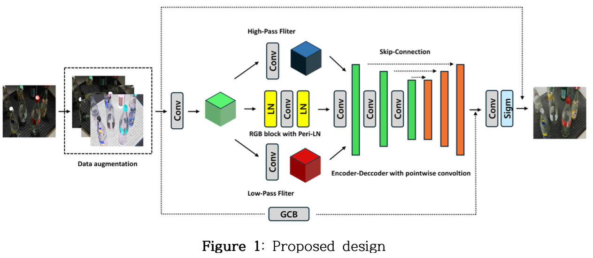
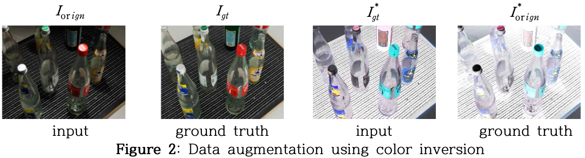
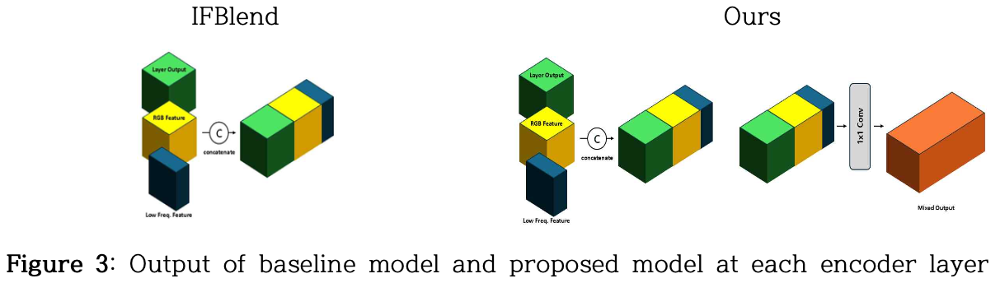
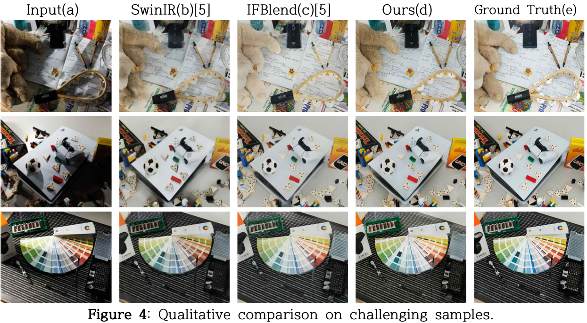
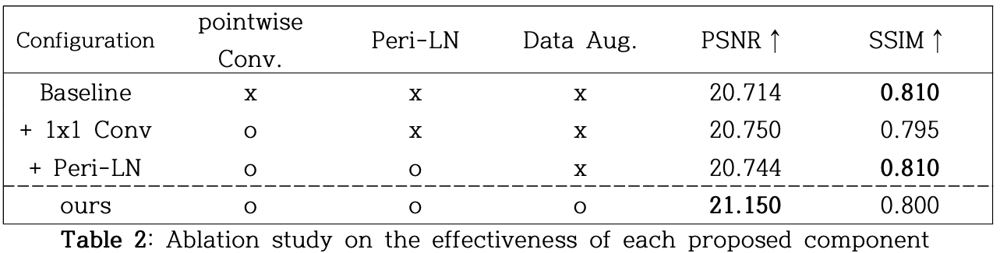
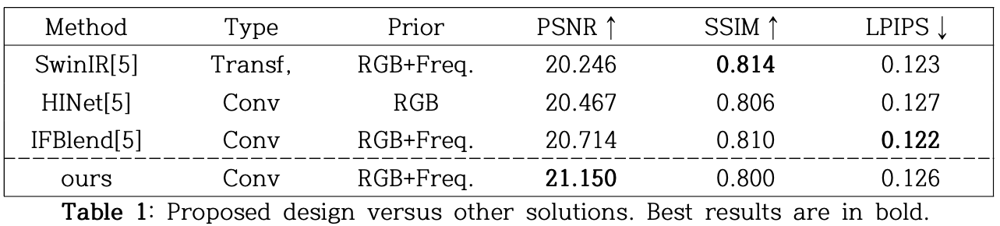

# Efficient-Ambient-Lighting-Normalization
CNN, IFBlend, Image Processing
## Overview
Ambient Lighting Normalization (ALN) is a critical challenge in computer vision, aiming to secure image consistency by removing illumination components (shadows, brightness non-uniformity) that hinder model stability. The IFBlend model, a SOTA method at the time (2025), provided solutions even in complex scenarios, but its performance still fell short compared to results achieved in simpler settings.

This project's objective is to develop an improved ALN model that exceeds the SOTA record of the baseline model and achieves performance comparable to that of simple scenarios, even in complex real-world environments. We hypothesized that IFBlend's performance limitation stemmed from insufficient model complexity/expressive power and introduced three core refinements to address this.

* Core Contribution: Introducing an innovative Data Augmentation technique that utilizes the physical symmetry of light and shadow to enhance the model's fundamental understanding of illumination.
* Achieved Result: Achieved a new State-of-the-Art (SOTA) result with only one-fourth (50 epochs) of the training duration required by competing models.

## Methodology & Implementation
The proposed model maintains the IFBlend's encoder-decoder architecture and frequency decomposition approach while incorporating three key modifications to enhance feature fusion, training stability, and data understanding.

**Symmetric Data Augmentation: Learning Light-Shadow Symmetry**
This novel technique helps the model move beyond simple pattern memorization to understand the fundamental physical symmetry between light and shadow.

* Principle: We leverage the hypothesis that shadow removal is a physically symmetric task to light addition (removing a shadow is equivalent to adding light to the shadowed region).
* Implementation: By applying Color Inversion to the original image pair and swapping the roles of the input and output we generate training pairs for the inverse task of adding light.
* Effect: This enables the model to learn a color-agnostic principle of illumination, significantly boosting its generalization performance. This accounts for over $\text{93%}$ of the total PSNR gain over the baseline.

**Enhanced Feature Fusion: Introducing Pointwise Convolution**
The original IFBlend encoder performed feature fusion via simple channel concatenation.

* Limitation: Simple concatenation is computationally efficient but limited in explicitly modeling the complex interactions between different feature types (e.g., spatial structure and frequency information).
* Solution: A Pointwise Convolution (1x1 Conv) layer was introduced immediately after feature concatenation in the encoder's fusion stage.
* Effect: The 1x1 Conv computes a weighted sum across the channel dimension, creating a single, semantically richer feature map and enhancing the model's representational power.

**Training Stabilization: Peri-Layer Normalization (Peri-LN)**
To ensure stable and sustained training, the original Pre-LN in the RGB processing block was replaced with Peri-Layer Normalization (Peri-LN), a technique inspired by LLM advancements.
* Principle: Peri-LN mitigates the instability of Pre-LN (exploding activations) and the vanishing gradient issue of Post-LN. It applies an additional normalization to the output, controlling the variance increase caused by accumulating residuals and ensuring a more uniform gradient flow.

## Result
**Quantitative Evaluation**

* New SOTA: The proposed model achieved a new SOTA PSNR of 21.150 on the Ambient6K benchmark, demonstrating a +0.436 PSNR improvement over the IFBlend baseline.

* Efficiency: This performance was achieved after only 50 epochs of training, which is one-fourth of the duration (200 epochs) typically required by competing models.

**Ablation Study**

* Main Driver: Symmetric Data Augmentation was the dominant factor, contributing +0.406 dB to the PSNR increase, accounting for over $\text{93%}$ of the total gain.

* Stabilization/Regularization: Peri-LN recovered the SSIM score from 0.795 to 0.810 , suggesting it acts as a regularizer that promotes structural consistency by controlling output variance, in addition to its primary role of stabilizing training.

**Qualitative Evaluation**

* Ground Truth Correction: The proposed model demonstrated a remarkably high level of generalization by visually correcting minor errors (e.g., color mismatch artifacts) present in the Ground Truth image itself, producing a more physically plausible result. This suggests the model learned a robust understanding of physical illumination consistency.

* Understanding Light Structure: The model restored boundaries most naturally in regions distorted by strong light, visually confirming that it learned the intrinsic "structure of light" itself, going beyond the simple task of darkening or brightening pixels.

## Key Insights & Reflection
**Innovation from Everyday Reflection**
* Source of Creativity: The innovative Data Augmentation technique, which became the primary driver of performance improvement, was inspired by an idea conceived while pursuing a hobby of drawing and painting (reflecting on the symmetry of light and shadow).
* Lesson Learned: Innovation does not require special conditions but originates from the practice of continuous reflection on everyday observations and the willingness to "twist" or reframe conventional perspectives.

**Limitations and Future Direction**
* Resource Constraints: Experiments were limited by the GPU RAM constraints of the Google Colab environment, limiting epoch and batch size settings.
* Parallel Optimization: To overcome resource limitations and maximize performance, future work should involve splitting the large model into smaller components, dividing the input data into clusters, training separate models for each cluster, and then employing an ensemble method.
* Metric Limitations: The model's superior visual quality was not fully captured by traditional metrics like SSIM and LPIPS due to potential GT imperfections. Future research will focus on:

Conducting Human Subjective Evaluation to validate true perceptual quality.

Combining L1 Loss with Perceptual Loss to directly optimize for visual quality.

Analyzing the effects of longer training durations (200 epochs) and conducting cross-dataset evaluation to confirm the robustness and generality of the proposed symmetric augmentation technique.

Extending the core ideas to video lighting normalization by incorporating temporal consistency.
